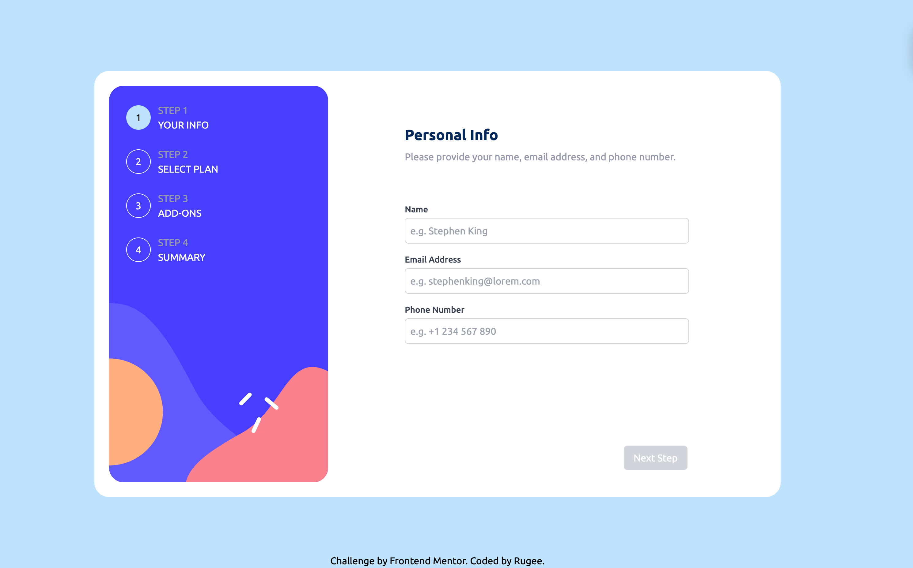

# Frontend Mentor - Multi-step form solution

This is a solution to the [Multi-step form challenge on Frontend Mentor](https://www.frontendmentor.io/challenges/multistep-form-YVAnSdqQBJ). Frontend Mentor challenges help you improve your coding skills by building realistic projects.

## Table of contents

- [Overview](#overview)
  - [The challenge](#the-challenge)
  - [Screenshot](#screenshot)
  - [Links](#links)
- [My process](#my-process) 
  - [Built with](#built-with)
  - [What I learned](#what-i-learned)
  - [Continued development](#continued-development)
  - [Useful resources](#useful-resources)
- [Author](#author)
- [Acknowledgments](#acknowledgments)

---

## Overview

### The challenge

Users should be able to:

- Navigate through multiple steps of the form seamlessly.
- Go back to a previous step to update their selections or input fields.
- View a summary of their selections on the final step and confirm their order.
- Use a dynamic multi-step interface based on the user's device screen size.
- View hover and focus states for all interactive elements.
- Receive form validation messages when:
  - A required field is left empty.
  - The email address is not formatted correctly.
  - An invalid phone number is entered.
- See their form data preserved when navigating back to a previous step.

### Screenshot



---

### Links

- Solution URL: [Solution URL](https://github.com/RugeeFan/Multi-step-form/)
- Live Site URL: [Live Demo](https://multi-step-form-main-steel.vercel.app/)

---

## My process

### Built with

- Semantic HTML5 markup
- CSS custom properties
- Flexbox for layout
- Tailwind CSS for styling
- Mobile-first workflow
- [React](https://reactjs.org/) - Frontend library
- [Redux Toolkit](https://redux-toolkit.js.org/) - State management
- [React Router DOM](https://reactrouter.com/) - Routing
- [Vite](https://vitejs.dev/) - Development environment

---

### What I learned

This project helped me solidify concepts of multi-step forms, data validation, and state management with Redux Toolkit. I also gained experience with `react-router-dom` for seamless navigation and preserving data between steps.

#### Key Code Snippets

1. **Form Validation Logic**:

   ```js
   const validateField = (field, value) => {
     let error = "";
     if (field === "email" && !/^[A-Za-z0-9._%+-]+@[A-Za-z0-9.-]+\.[A-Za-z]{2,}$/.test(value)) {
       error = "Please enter a valid email address.";
     }
     return error;
   };
   ```

2. **Redux Slice for Managing Form State**:

   ```js
   import { createSlice } from "@reduxjs/toolkit";
   
   const initialState = {
     personalInfo: {
       name: "",
       email: "",
       phone: "",
     },
     selectedPlan: "arcade",
     billingCycle: "monthly",
     addOns: [],
   };
   
   const formSlice = createSlice({
     name: "form",
     initialState,
     reducers: {
       setPersonalInfo: (state, action) => {
         state.personalInfo = action.payload;
       },
       setSelectedPlan: (state, action) => {
         state.selectedPlan = action.payload;
       },
       setBillingCycle: (state, action) => {
         state.billingCycle = action.payload;
       },
       toggleAddOn: (state, action) => {
         if (state.addOns.includes(action.payload)) {
           state.addOns = state.addOns.filter((id) => id !== action.payload);
         } else {
           state.addOns.push(action.payload);
         }
       },
     },
   });
   
   export const { setPersonalInfo, setSelectedPlan, setBillingCycle, toggleAddOn } = formSlice.actions;
   export default formSlice.reducer;
   ```

3. **React Router DOM Integration**:

   ```jsx
   import { BrowserRouter as Router, Routes, Route } from "react-router-dom";
   import PersonalInfoForm from "./components/PersonalInfoForm";
   import SelectPlan from "./components/SelectPlan";
   import PickAddOns from "./components/PickAddOns";
   import Summary from "./components/Summary";
   import ThankYou from "./components/ThankYou";
   
   const App = () => (
     <Router>
       <Routes>
         <Route path="/personalinfo" element={<PersonalInfoForm />} />
         <Route path="/selectplan" element={<SelectPlan />} />
         <Route path="/addon" element={<PickAddOns />} />
         <Route path="/summary" element={<Summary />} />
         <Route path="/thankyou" element={<ThankYou />} />
         <Route path="/" element={<PersonalInfoForm />} />
       </Routes>
     </Router>
   );
   
   export default App;
   ```

---

### Continued development

I aim to further refine my understanding of:

- Advanced state management with Redux Toolkit (e.g., selectors and middleware).
- Accessibility improvements for forms, including keyboard navigation and screen reader support.
- Optimizing performance in larger applications with techniques like lazy loading and code splitting.

---

### Useful resources

- [Redux Toolkit Documentation](https://redux-toolkit.js.org/) - Helped me simplify state management and build scalable reducers.
- [React Router Documentation](https://reactrouter.com/docs/en/v6) - Comprehensive guide for implementing navigation.
- [Tailwind CSS Documentation](https://tailwindcss.com/docs) - Provided easy-to-use classes for styling.

---

## Author

- Frontend Mentor - [@RugeeFan](https://www.frontendmentor.io/profile/RugeeFan)

---

## Acknowledgments

Special thanks to the Frontend Mentor community for their feedback and inspiration during this project.
